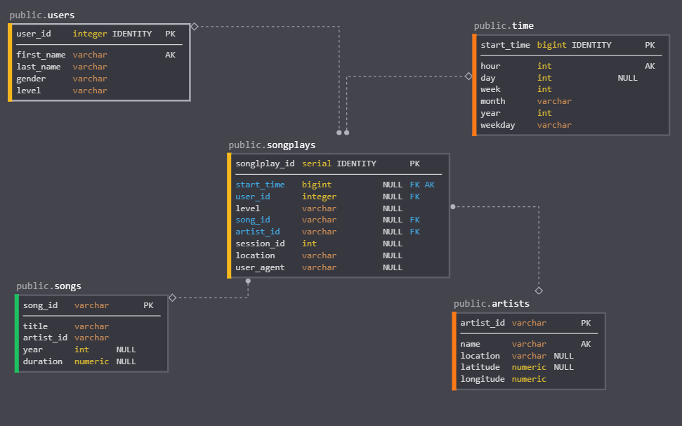
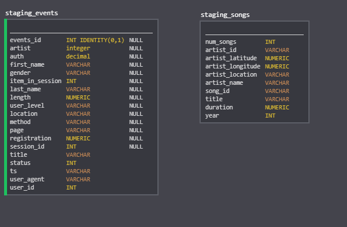

# DataWarehousing with Redshift and S3

### Udacity Data Engineer Nano Degree

## Introduction
The purpose of this specific project was to learn how to successfully take data from S3, create an ETL pipeline to our staging tables, and finally insert the data from our staging tables into the appropriate tables in our star schema. 
There are two data sources provided in this project. One is a list of random songs (ID's, the artists, name of the songs, locations, ETC). The other data source provides information surrounding the events of those specific songs (what actions did the users take on that specific song). Our fictional company "Sparkify", is looking for a way to store this information which is easily accessible to our data analysts, as well as having to not worry about how this data is going to be funneled through from S3 to Redshift. 

## The ETL Pipeline

Udacity provided us with specific S3 buckets to access the two data sources. First, we needed to create a script to create all the necessary tables to move forward. From there we needed to copy over the data from S3 to the staging tables we created, specifically *staging_events* and *staging_songs*. Once the upload from S3 to the staging tables is complete, we simply take the data from these tables and create insert queries to load them to our star schema tables. 
Above you will find table and ETL images demonstrating the process.

## What you need.
You'll need a certain level of Python.3x installed and the *Python* libraries *configparser* and *psycopg2*. You will also need to setup your own instance of Redshift on your AWS account. Once you have all this done you can simply configure the *dwh.cfg* file to whatever settings you created on your Redshift cluster.

    [CLUSTER]
    HOST = redshift-cluster-endpoint
    DB_NAME = db_name
    DB_USER = user
    DB_PASSWORD = password
    DB_PORT= 5439 (standard)
    
    [IAM_ROLE]
    ARN = configured IAM role 
    
    [S3]
    LOG_DATA='{path to S3 bucket}'
    LOG_JSONPATH='{path to S3 bucket}'
    SONG_DATA='{path to S3 bucket}'

